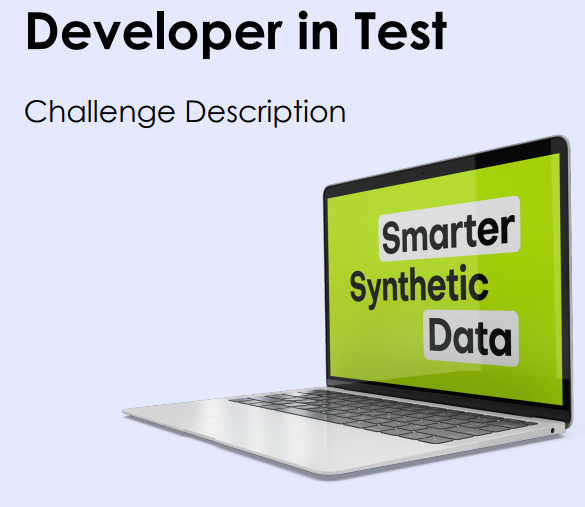

# MOSTLY QA code challenge

## Description
This project contains technical code challenge for QA Engineer interview. Implementation made with `Cypress` by 'Michal Kmiecik'.

The files and folders are structured already and the `spec` files already contain skeleton code with **fill-in areas** (marked with `// type your code here...`), where the challenge's solution is expected to be filled in.



Each exercise/question has a difficulty level marker from the following list: 1️⃣ | 2️⃣ | 3️⃣ | 4️⃣ 
✨ Tricky or extra (harder) questions are marked with this symbol.

While providing implementations, please fill in the right place in the code (or at least try).

```js
// 1️⃣  Verify bookmarks
// ====================================

    // type your code here...

// ====================================
```

```js
// 2️⃣  Search for no results
// ====================================

    mycode.doSomeLoginMagic();

// ====================================
```

```js
// 3️⃣  Fill the contact form
// ====================================

    mycode.doSomeLoginMagic();

// ====================================
```


## Prerequisites

- install NodeJs latest LTS version
- `npm ci` to install the project dependencies //npm i?

## Commands

- run tests in cypress: `npm run cypress`
